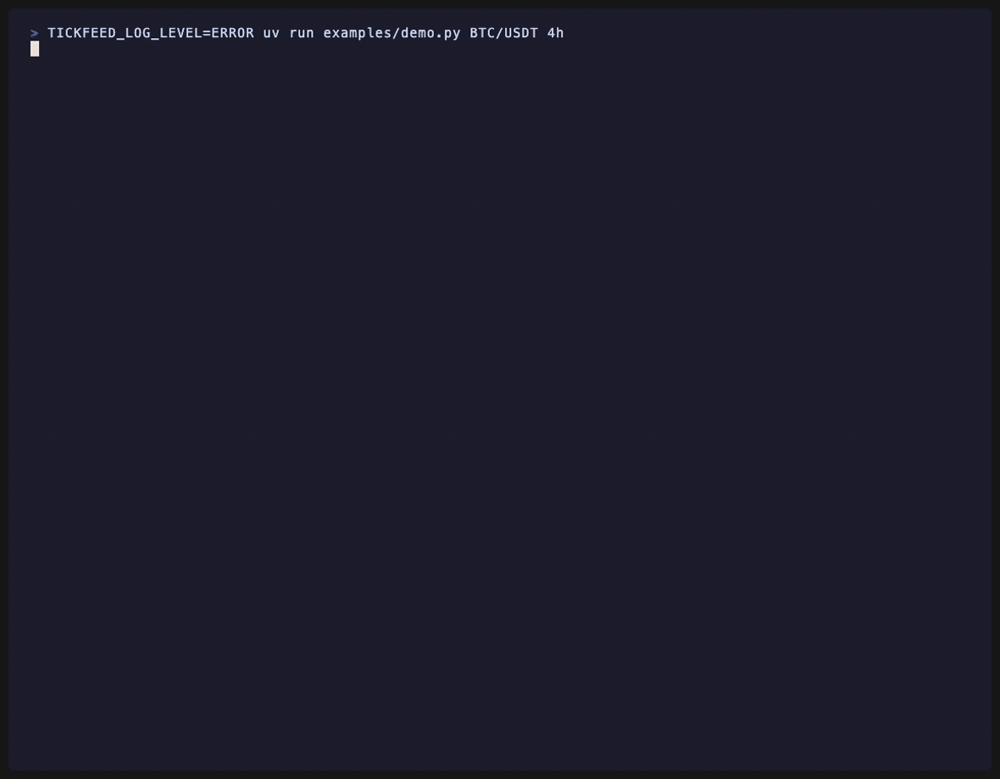

<div align="center">

# TickFeed MCP

**あらゆる AI エージェントのための、リアルタイムで無料の暗号資産マーケットデータ —— MCP 経由で。**

[](https://pypi.org/project/tickfeed-mcp/)
[](https://pypi.org/project/tickfeed-mcp/)
[](LICENSE)
[](https://github.com/seungdori/tickfeed-mcp/actions/workflows/ci.yml)
[](https://github.com/astral-sh/ruff)
[](https://mypy-lang.org/)
[](https://modelcontextprotocol.io)

[English](README.md) · [한국어](README.ko.md) · [中文](README.zh-CN.md) · **日本語**



</div>

TickFeed は、あらゆる MCP クライアント（Claude Code、Cursor、Codex、Gemini CLI など）に**リアルタイムおよびヒストリカルな暗号資産マーケットデータを無料で**提供する、セルフホスト可能な [Model Context Protocol](https://modelcontextprotocol.io) サーバーです。バックグラウンドで取引所の WebSocket 接続を温めておくことで、エージェントは**サブ秒の鮮度**を持つ価格をそのまま読み取れます。同じサーバーが **73 種類のテクニカル指標**と**チャート構造の認識**まで提供し、API キーも不要です。

> ⚠️ 教育・研究用ツールです。金融・投資・取引の助言は提供しません。データの正確性・適時性も保証しません。

---

## 目次

- [なぜ](#なぜ) · [デモを動かす](#デモを動かす) · [30 秒インストール](#30-秒インストール)
- [対応取引所](#対応取引所) · [ツール](#ツール) · [指標](#指標73-種) · [構造認識](#構造認識)
- [プロンプト例](#プロンプト例) · [設定](#設定) · [開発](#開発) · [ロードマップ](#ロードマップ)

## なぜ

取引エージェントは爆発的に増えていますが、その土台となるデータ層は、いまだに断片化し、REST ポーリングに限られ、有料な場合も少なくありません。TickFeed はそうしたエージェントに、**リアルタイムで無料のマーケットデータ**を 1 つのサーバーから提供します —— 複数の取引所、API キー不要。

## デモを動かす

```bash
uv run examples/demo.py            # BTC/USDT のライブ・ウォークスルー（API キー不要）
uv run examples/demo.py ETH/USDT 4h
```

ライブの Binance/Bybit/OKX に対するカラー端末のウォークスルーです —— コールド→ウォームの鮮度（REST → WebSocket）、シグナル付きの指標、ダイバージェンス、マーケット構造、サポート/レジスタンス。上部の GIF にする方法は [examples/RECORDING.md](examples/RECORDING.md) を参照してください。

## 30 秒インストール

```bash
uvx tickfeed-mcp
```

クライアントに登録します（Claude Code の例、[`examples/claude_code_config.json`](examples/claude_code_config.json)）：

```json
{
  "mcpServers": {
    "tickfeed": {
      "command": "uvx",
      "args": ["tickfeed-mcp"],
      "env": {
        "TICKFEED_EXCHANGES": "binance,bybit,okx",
        "TICKFEED_DEFAULT_EXCHANGE": "binance"
      }
    }
  }
}
```

Cursor、Codex、Gemini CLI も、それぞれの MCP 設定ファイルで同じ `command`/`args`/`env` の形を使います。

## 対応取引所

| 取引所 | REST | WebSocket |
|---|:---:|:---:|
| Binance | ✅ | ✅ |
| Bybit | ✅ | ✅ |
| OKX | ✅ | ✅ |

[ccxt](https://github.com/ccxt/ccxt) が対応する取引所はすべて `TICKFEED_EXCHANGES` で有効化できます。公開データのみ —— キー不要。

## ツール

| ツール | 機能 |
|---|---|
| `list_exchanges` | 設定済みの取引所 + デフォルト |
| `list_symbols` | 取引可能なシンボル（決済通貨/検索でフィルタ） |
| `get_ticker` | 現在の価格スナップショット（最優先ツール） |
| `get_recent_trades` | ライブバッファからの直近約定 |
| `get_ohlcv` | ヒストリカルなローソク足（DuckDB キャッシュ） |
| `get_orderbook` | 板スナップショット + スプレッド |
| `compute_indicators` | 73 指標（RSI/MACD/Supertrend/WaveTrend/Squeeze/…）と派生シグナル |
| `detect_divergence` | 通常/ヒドゥンの強気・弱気ダイバージェンス（価格 vs オシレーター） |
| `detect_cross` | Pine 風の `ta.crossover`/`ta.crossunder`（任意の 2 系列） |
| `detect_patterns` | ローソク足パターン（包み足、ハンマー、星など）とバイアス |
| `analyze_structure` | マーケット構造：スイング、トレンド、BOS / CHoCH |
| `find_support_resistance` | スイング・ピボットから集約したサポート/レジスタンス帯 |
| `screen_market` | 指標/価格条件で複数銘柄をスクリーニング |
| `get_aggregated_price` | 出来高加重価格 + 取引所間スプレッド（裁定） |
| `get_funding_rate` | 無期限先物のファンディングレート |
| `watch_symbol` | ライブ購読の事前ウォームアップ（任意） |
| `get_watched_symbols` | アクティブな購読 + バッファ状態 |
| `server_status` | ヘルス / 診断 |

すべてのマーケットデータ応答には `source`（`websocket`|`rest`）、`age_ms`、`timestamp` が含まれ、鮮度を常に証明できます。

### 指標（73 種）

- **移動平均 / オーバーレイ：** `sma ema wma smma dema tema hma vwma zlema alma kama trima lsma vidya t3 vwap vwapbands bbands donchian keltner supertrend ichimoku psar`
- **モメンタム：** `rsi stochrsi macd ppo stoch cci willr roc mom tsi ao cmo uo dpo trix coppock kst fisher rvi mfi wavetrend squeeze qqe crsi stc elderray zscore linregslope`
- **ボラティリティ：** `atr natr stdev hv chop ulcer massindex`
- **出来高：** `obv adl cmf chaikinosc eom fi pvt vo klinger`
- **トレンド：** `adx dmi aroon vortex`
- **構造：** `heikinashi pivots`

仕様は `"name:p1,p2"` 形式で、**Pine Script 構文** —— `ta.rsi(14)`、`ta.ema(20)`、`ta.wt(10,21)`、`ta.sqz` —— も受け付けるため、TradingView ユーザーは見慣れた表現をそのまま貼り付けられます。派生シグナルには、買われすぎ/売られすぎの state、MACD/PPO/WaveTrend/QQE のクロス、オシレーターのゼロラインクロス、Supertrend/PSAR の direction & flip、squeeze の on/off、DMI/Heikin-Ashi のトレンド、Ichimoku の雲の位置が含まれます。暗号資産/Pine の定番（WaveTrend、TTM Squeeze、QQE、Connors RSI、Schaff Trend Cycle、VIDYA、T3）を内蔵。新しい指標の追加は `REGISTRY` への 1 行の宣言だけです。

### 構造認識

TickFeed は数値指標に加えて、*いまチャートで起きていること*まで記述します。`detect_patterns` はローソク足パターン（包み足、ハンマー/首吊り線、十字線系、明けの明星/宵の明星、赤三兵/黒三兵 など）をバイアス付きで命名し、`analyze_structure` は HH/HL/LH/LL でラベル付けしたスイング高値・安値、推定トレンド、Break-of-Structure / Change-of-Character イベント（SMC スタイル）を返し、`find_support_resistance` はスイング・ピボットをサポート/レジスタンス帯に集約してタッチ回数を数えます。これにより、エージェントはトレーダーの言葉でチャートを*語れる*ようになります。

### リソース

対応クライアントは、ライブ状態を MCP リソースとして読み取れます：`tickfeed://status`、`tickfeed://watched`、テンプレート `tickfeed://ticker/{exchange}/{symbol}`。

## プロンプト例

- 「Binance の BTC/USDT、いまいくら？24 時間の変化率は？」
- 「BTC/USDT の 1 時間足で RSI と MACD を計算して、ダイバージェンスがあるか見て。」
- 「出来高上位 30 の USDT ペアから、RSI が 30 未満のものをスクリーニングして。」
- 「Bybit の BTC 無期限、いまのファンディングレートは？」
- 「ETH/USDT の板、上位 10 段のスプレッドを見せて。」

## 設定

すべての設定は環境変数です（[`.env.example`](.env.example) 参照）：

| 変数 | デフォルト | 説明 |
|---|---|---|
| `TICKFEED_EXCHANGES` | `binance,bybit,okx` | 有効な取引所（カンマ区切り） |
| `TICKFEED_DEFAULT_EXCHANGE` | `binance` | `exchange` 省略時のデフォルト |
| `TICKFEED_MAX_WATCHED_SYMBOLS` | `25` | 同時 WS 購読の上限（超過時は LRU で解放） |
| `TICKFEED_RING_BUFFER_SIZE` | `1000` | シンボルごとの約定バッファサイズ |
| `TICKFEED_OHLCV_CACHE_PATH` | `~/.tickfeed/ohlcv.duckdb` | DuckDB キャッシュファイル |
| `TICKFEED_OHLCV_CACHE_TTL_S` | `60` | 最新ローソク足の鮮度ウィンドウ |
| `TICKFEED_REST_RETRIES` | `3` | 一時的な REST エラー（レート制限/ネットワーク）の再試行回数 |
| `TICKFEED_SCREEN_CONCURRENCY` | `5` | スクリーニング/集約時の同時シンボル数 |
| `TICKFEED_TRANSPORT` | `stdio` | `stdio` または `http` |
| `TICKFEED_LOG_LEVEL` | `INFO` | ログレベル |

## 開発

```bash
uv venv && uv pip install -e ".[dev]"
pytest                # 約 100 の単体 + MCP 統合テスト（ライブ除外）
pytest -m live        # ライブ取引所テスト（Binance/Bybit/OKX、ローカル実行）
ruff check . && mypy  # リント + 型ゲート
```

テストは、指標の数学を参照値と照合し、サービスのキャッシュ/auto-watch ロジック、完全な MCP ツール経路（`tests/test_mcp_integration.py` が `mcp.call_tool` 経由で呼び出し）、価格構造の認識、そして実取引所に対してスタック全体を検証するライブスイートをカバーします。プロジェクト構成と貢献の流れは [CONTRIBUTING.md](CONTRIBUTING.md) を参照してください。

## ロードマップ

- [x] Pine Script 風の指標マッピング（`ta.rsi`、`ta.crossover` など）
- [x] 73 指標 + ローソク足パターン + マーケット構造（BOS/CHoCH）
- [x] マルチ取引所集約（加重価格 / スプレッド）
- [x] watched シンボルの MCP リソースプッシュ
- [ ] アンカー / セッション VWAP
- [ ] 取引所の拡充（Kraken、Bitget、Gate など）
- [ ] Agent Skill（`SKILL.md`）ラッパー

## 貢献

Issue と PR を歓迎します —— [CONTRIBUTING.md](CONTRIBUTING.md) と[行動規範](CODE_OF_CONDUCT.md)を参照してください。依存関係は最小限に保ち、v1 のスコープを読み取り専用（公開データ、発注なし、API シークレットなし）に維持してください。

## ライセンス

[MIT](LICENSE) © TickFeed contributors.

## 免責事項

本ツールは**教育・研究目的のみ**を対象とします。金融・投資・取引の助言ではありません。マーケットデータは遅延・不完全・不正確な場合があるため、実際の取引判断に依存しないでください。各取引所の利用規約とレート制限を遵守してください。[SECURITY.md](SECURITY.md) 参照。
