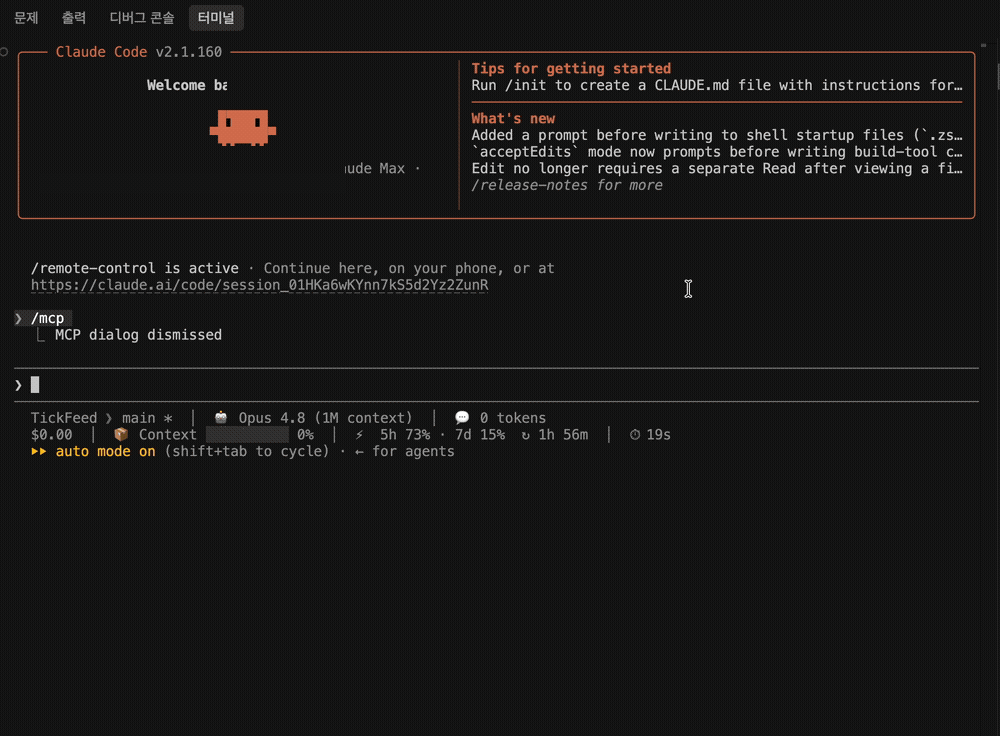

<div align="center">

# Tickscope MCP

**모든 AI 에이전트를 위한 실시간 무료 암호화폐 시세 데이터 — MCP로.**

[](https://pypi.org/project/tickscope-mcp/)
[](https://pypi.org/project/tickscope-mcp/)
[](LICENSE)
[](https://github.com/seungdori/tickscope-mcp/actions/workflows/ci.yml)
[](https://github.com/astral-sh/ruff)
[](https://mypy-lang.org/)
[](https://modelcontextprotocol.io)

[English](README.md) · **한국어** · [中文](README.zh-CN.md) · [日本語](README.ja.md)



</div>

Tickscope는 모든 MCP 클라이언트(Claude Code, Cursor, Codex, Gemini CLI 등)에 **실시간·과거 암호화폐 시세 데이터를 무료로** 제공하는 셀프호스팅 [Model Context Protocol](https://modelcontextprotocol.io) 서버입니다. 백그라운드에서 거래소 WebSocket 연결을 항상 열어 두므로, 에이전트는 그 연결에서 **생성된 지 1초도 안 된 최신** 시세를 즉시 받아 옵니다. 같은 서버가 **기술 지표 73종**과 **차트 구조 인식**까지 제공하며, API 키도 필요 없습니다.

> ⚠️ 교육·연구용 도구입니다. 금융·투자·트레이딩 조언을 제공하지 않으며, 데이터의 정확성·적시성을 보증하지 않습니다.

---

## 목차

- [왜](#왜) · [실행 데모](#실행-데모) · [30초 설치](#30초-설치)
- [지원 거래소](#지원-거래소) · [툴](#툴) · [지표](#지표-73종) · [구조 인식](#구조-인식)
- [예시 프롬프트](#예시-프롬프트) · [설정](#설정) · [개발](#개발) · [로드맵](#로드맵)

## 왜

트레이딩 에이전트는 폭발적으로 늘고 있지만, 정작 바탕이 되는 데이터 계층은 여전히 파편화돼 있고 REST 폴링만 되는 데다 유료인 경우가 많습니다. Tickscope는 이런 에이전트에 **실시간 무료 시세 데이터**를 단일 서버로 제공합니다 — 멀티 거래소, API 키 불필요.

## 실행 데모

```bash
uv run examples/demo.py            # BTC/USDT 라이브 워크스루 (API 키 불필요)
uv run examples/demo.py ETH/USDT 4h
```

실거래소(Binance·Bybit·OKX) 대상의 컬러 터미널 워크스루입니다 — 콜드→웜 신선도(REST → WebSocket), 신호가 포함된 지표, 다이버전스, 마켓 스트럭처, 지지/저항. 위 GIF로 만드는 방법은 [examples/RECORDING.md](examples/RECORDING.md)를 참고하세요.

## 30초 설치

```bash
uvx tickscope-mcp
```

클라이언트에 등록합니다 (Claude Code 예시, [`examples/claude_code_config.json`](examples/claude_code_config.json)):

```json
{
  "mcpServers": {
    "tickscope": {
      "command": "uvx",
      "args": ["tickscope-mcp"],
      "env": {
        "TICKSCOPE_EXCHANGES": "binance,bybit,okx",
        "TICKSCOPE_DEFAULT_EXCHANGE": "binance"
      }
    }
  }
}
```

Cursor, Codex, Gemini CLI도 각자의 MCP 설정 파일에서 동일한 `command`/`args`/`env` 형태를 사용합니다.

## 지원 거래소

| 거래소 | REST | WebSocket |
|---|:---:|:---:|
| Binance | ✅ | ✅ |
| Bybit | ✅ | ✅ |
| OKX | ✅ | ✅ |

[ccxt](https://github.com/ccxt/ccxt)가 지원하는 어떤 거래소든 `TICKSCOPE_EXCHANGES`로 활성화할 수 있습니다. 공개 데이터만 사용 — 키 불필요.

## 툴

| 툴 | 설명 |
|---|---|
| `list_exchanges` | 설정된 거래소 + 기본값 |
| `list_symbols` | 거래 가능 심볼 (견적통화/검색 필터) |
| `get_ticker` | 현재 시세 스냅샷 (최우선 사용 툴) |
| `get_recent_trades` | 라이브 버퍼의 최근 체결 |
| `get_ohlcv` | 과거 캔들 (DuckDB 캐시) |
| `get_orderbook` | 호가창 스냅샷 + 스프레드 |
| `compute_indicators` | 지표 73종 (RSI/MACD/Supertrend/WaveTrend/Squeeze/…) + 파생 신호 |
| `detect_divergence` | 일반/히든 상승·하락 다이버전스 (가격 vs 오실레이터) |
| `detect_cross` | Pine 스타일 `ta.crossover`/`ta.crossunder` (임의 두 시계열) |
| `detect_patterns` | 캔들스틱 패턴 (engulfing, hammer, star 등) + bias |
| `analyze_structure` | 마켓 스트럭처: 스윙, 추세, BOS / CHoCH |
| `find_support_resistance` | pivot 군집 기반 지지/저항 존 |
| `deep_analyze` | 멀티 타임프레임 종합 분석: 추세 합류 + 시장 상태 맥락 + 과거 신호 성과, 그리고 종합 판정 |
| `screen_market` | 지표/가격 조건으로 멀티 심볼 스크리닝 |
| `get_aggregated_price` | 거래량 가중가 + 거래소 간 스프레드 (차익) |
| `get_funding_rate` | 무기한 선물 펀딩비 |
| `watch_symbol` | 라이브 구독 사전 워밍 (옵션) |
| `get_watched_symbols` | 활성 구독 + 버퍼 상태 |
| `server_status` | 헬스 / 진단 |

시세와 관련된 모든 응답에는 `source`(`websocket`|`rest`), `age_ms`, `timestamp`가 들어 있어 데이터가 얼마나 최신인지 언제든 확인할 수 있습니다.

### 지표 (73종)

- **이동평균 / 오버레이:** `sma ema wma smma dema tema hma vwma zlema alma kama trima lsma vidya t3 vwap vwapbands bbands donchian keltner supertrend ichimoku psar`
- **모멘텀:** `rsi stochrsi macd ppo stoch cci willr roc mom tsi ao cmo uo dpo trix coppock kst fisher rvi mfi wavetrend squeeze qqe crsi stc elderray zscore linregslope`
- **변동성:** `atr natr stdev hv chop ulcer massindex`
- **거래량:** `obv adl cmf chaikinosc eom fi pvt vo klinger`
- **추세:** `adx dmi aroon vortex`
- **구조:** `heikinashi pivots`

스펙은 `"name:p1,p2"` 형식이며 **Pine Script 표기** — `ta.rsi(14)`, `ta.ema(20)`, `ta.wt(10,21)`, `ta.sqz` — 도 받으므로 TradingView 사용자가 익숙한 표현을 그대로 붙여넣을 수 있습니다. 파생 신호로는 과매수/과매도 상태, MACD/PPO/WaveTrend/QQE cross, 오실레이터 zero-line cross, Supertrend/PSAR direction & flip, squeeze on/off, DMI/Heikin-Ashi 추세, Ichimoku 구름 위치가 있습니다. 크립토/Pine 인기 지표(WaveTrend, TTM Squeeze, QQE, Connors RSI, Schaff Trend Cycle, VIDYA, T3)를 포함합니다. 새 지표는 `REGISTRY`에 한 줄만 선언하면 추가됩니다.

### 구조 인식

Tickscope는 숫자 지표에 더해 *지금 차트에서 벌어지는 일*까지 설명합니다: `detect_patterns`는 캔들스틱 패턴(engulfing, hammer/hanging man, doji 계열, morning/evening star, three soldiers/crows 등)을 bias와 함께 명명하고, `analyze_structure`는 HH/HL/LH/LL로 라벨링된 스윙 고/저점, 추세, Break-of-Structure / Change-of-Character 이벤트(SMC 방식)를 반환하며, `find_support_resistance`는 스윙 pivot을 지지/저항 존으로 군집화하고 touch 수를 셉니다. 덕분에 에이전트도 트레이더처럼 차트를 말로 풀어 설명할 수 있습니다.

### 심층 분석

`deep_analyze`는 한 번의 호출로 한 심볼을 여러 타임프레임에 걸쳐 종합적으로 읽어 줍니다. 에이전트가 여러 도구를 직접 엮을 필요가 없습니다. 반환 항목은 다음과 같습니다:

- **멀티 타임프레임 추세 합류** — 같은 심볼을 1d/4h/1h로 위에서 아래로 훑어, 각 타임프레임이 서로 맞물리는지 엇갈리는지 알려줍니다.
- **시장 상태 맥락** — 가격이 최근 구간에서 어디쯤에 있는지(백분위), 추세 상태(`trending_up` / `trending_down` / `ranging`, ADX + Kaufman 효율비 기반), 변동성 상태(ATR 백분위). 덕분에 "RSI 30" 같은 값도 그 값이 나온 상황에 비춰 해석할 수 있습니다.
- **과거 신호 성과** — 지금 잡힌 다이버전스에 대해, 같은 심볼/타임프레임에서 과거에 *확정된* 모든 발생의 이후 수익률 분포(횟수, 승률, 중앙값)를 냅니다. 미래 데이터를 끌어다 쓰거나 리페인트하지 않고, 과거 시점 기준으로만 측정합니다.
- **종합 판정** — bias, 신뢰도, 타임프레임 일치도, 실행 타임프레임의 시장 상태, 그리고 명시적인 주의사항까지 Python에서 결정론적으로 계산하므로, 판단이 모델의 눈대중에 좌우되지 않습니다.

가벼운 `compute_indicators`도 이제 같은 시장 상태 맥락을 함께 반환하며(비용은 거의 0), 신호 이력은 확정 봉 단위로 메모이즈되어 워밍된 조회는 그대로 빠릅니다. MCP 프롬프트를 지원하는 클라이언트에서는 슬래시 명령 `/mcp__tickscope__deep_analyze`(심볼·타임프레임 인자)로도 노출되어, 사용자가 전체 분석을 직접 띄울 수 있습니다.

### 리소스

지원하는 클라이언트는 라이브 상태를 MCP 리소스로 읽을 수 있습니다: `tickscope://status`, `tickscope://watched`, 그리고 템플릿 `tickscope://ticker/{exchange}/{symbol}`.

## 예시 프롬프트

- "바이낸스 BTC/USDT 지금 시세랑 24시간 변동률 알려줘."
- "이 SOL/USDT 셋업 진입할 만해? 여러 타임프레임으로 깊게 분석해줘."
- "BTC/USDT 4시간봉에 RSI 다이버전스 있어? 있으면 이 종목에서 과거에 그 신호 결과가 어땠는지도."
- "USDT 거래량 상위 50개 중 RSI 30 미만인 것만 스크리닝해줘."
- "ETH/USDT 4시간봉 주요 지지·저항 짚어주고, 방금 구조 깨졌는지(BOS/CHoCH)도 봐줘."
- "Bybit BTC 무기한 펀딩비 지금 얼마야? 과열이야?"
- "BTC/USDT를 바이낸스·바이비트·OKX 비교해서 차익 스프레드 보여줘."

더 많은 예시는 [`examples/demo_prompts.md`](examples/demo_prompts.md) 레시피북을 참고하세요 (심층 분석, 신호 과거 검증, 스크리닝, 모니터링, 전략 점검 등).

## 설정

모든 설정은 환경 변수입니다 ([`.env.example`](.env.example) 참고):

| 변수 | 기본값 | 설명 |
|---|---|---|
| `TICKSCOPE_EXCHANGES` | `binance,bybit,okx` | 활성 거래소 (콤마 구분) |
| `TICKSCOPE_DEFAULT_EXCHANGE` | `binance` | `exchange` 생략 시 기본값 |
| `TICKSCOPE_MAX_WATCHED_SYMBOLS` | `25` | 동시 WS 구독 상한 (초과 시 LRU 해제) |
| `TICKSCOPE_RING_BUFFER_SIZE` | `1000` | 심볼당 체결 버퍼 크기 |
| `TICKSCOPE_OHLCV_CACHE_PATH` | `~/.tickscope/ohlcv.duckdb` | DuckDB 캐시 파일 |
| `TICKSCOPE_OHLCV_CACHE_TTL_S` | `60` | 최신 캔들 신선도 윈도우 |
| `TICKSCOPE_REST_RETRIES` | `3` | 일시적 REST 오류(레이트리밋/네트워크) 재시도 횟수 |
| `TICKSCOPE_SCREEN_CONCURRENCY` | `5` | 스크리닝/집계 시 동시 심볼 수 |
| `TICKSCOPE_TRANSPORT` | `stdio` | `stdio` 또는 `http` |
| `TICKSCOPE_LOG_LEVEL` | `INFO` | 로그 레벨 |

## 개발

```bash
uv venv && uv pip install -e ".[dev]"
pytest                # 약 100개 단위 + MCP 통합 테스트 (라이브 제외)
pytest -m live        # 라이브 거래소 테스트 (Binance/Bybit/OKX, 로컬 실행)
ruff check . && mypy  # 린트 + 타입 게이트
```

테스트는 지표 수학을 기준값과 대조하고, 서비스 캐시/auto-watch 로직, 전체 MCP 툴 경로(`tests/test_mcp_integration.py`가 `mcp.call_tool`로 호출), 가격 구조 인식, 그리고 실거래소를 상대로 전체 스택을 검증하는 라이브 스위트를 다룹니다. 프로젝트 구조와 기여 절차는 [CONTRIBUTING.md](CONTRIBUTING.md)를 참고하세요.

## 로드맵

- [x] Pine Script 스타일 지표 매핑 (`ta.rsi`, `ta.crossover` 등)
- [x] 지표 73종 + 캔들 패턴 + 마켓 스트럭처 (BOS/CHoCH)
- [x] 멀티거래소 집계 (가중가 / 스프레드)
- [x] watched 심볼 MCP 리소스 푸시
- [ ] Anchored / 세션 VWAP
- [ ] 거래소 확장 (Kraken, Bitget, Gate 등)
- [ ] Agent Skill (`SKILL.md`) 래퍼

## 기여

이슈와 PR을 환영합니다 — [CONTRIBUTING.md](CONTRIBUTING.md)와 [행동 강령](CODE_OF_CONDUCT.md)을 참고하세요. 의존성을 최소로 유지하고 v1 범위를 읽기 전용(공개 데이터, 주문 실행 없음, API 시크릿 없음)으로 지켜주세요.

## 라이선스

[MIT](LICENSE) © Tickscope contributors.

## 면책 고지

본 도구는 **교육·연구 목적 전용**입니다. 금융·투자·트레이딩 조언이 아닙니다. 시세 데이터는 지연·불완전·부정확할 수 있으니 실제 거래 판단에 의존하지 마세요. 각 거래소의 이용약관과 레이트리밋을 준수하세요. [SECURITY.md](SECURITY.md) 참고.
